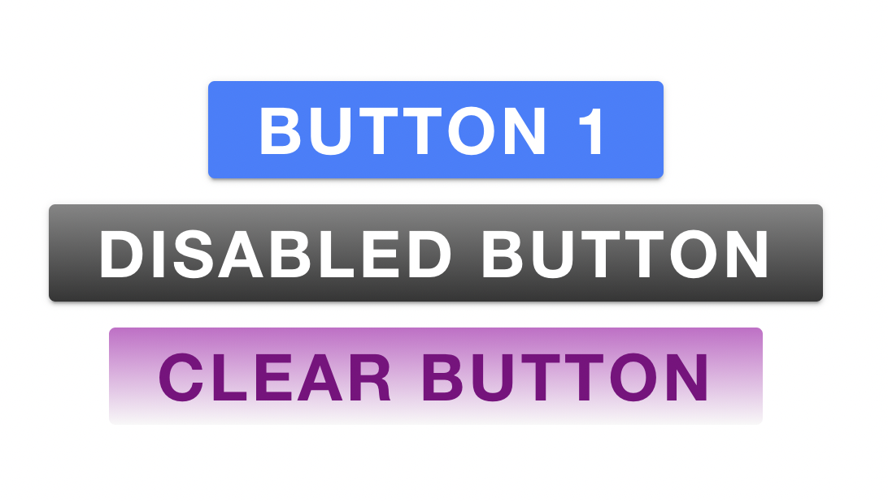

# Customizing Ionic Buttons

Ionic components can be customized through css, scss or when the component has styling of its own that you want to custom then using custom css variables.

These examples are styles globally in the `variables.scss` file.

This example show's a buttons font weight and size being changed:
```scss
ion-button {  
  font-weight: bolder;
  font-size: 40px;
}
```

This show a button being changed when the mouse is hovered over the button:
```scss
ion-button:hover {
  --background: green;
  // This demonstrates box shadow on hover
  box-shadow: 0 15px 10px #777;
}
```

You can also customize the disabled style of a button:
```scss
ion-button {
  &[disabled] {
    // This shows how the button background can be changed for disabled mode
    --background: linear-gradient(rgb(133, 133, 133), rgb(53, 53, 53));

    opacity: 1;

    // This show the button text color can be changed for disabled mode
    color: linear-gradient(rgb(161, 161, 161), rgb(255, 255, 255));
  }
}
```

Styling doesnt have to be for all `ion-button`s. You can style based on a class (`<ion-button class="custom-clear" />`)
```scss
ion-button {  
    &.custom-clear {
      color: purple;
    }
}
```

## Example Project Screenshot
